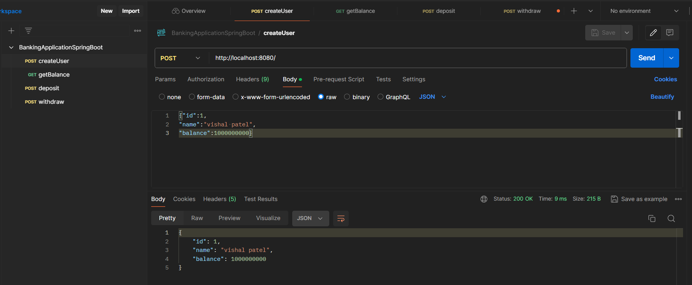
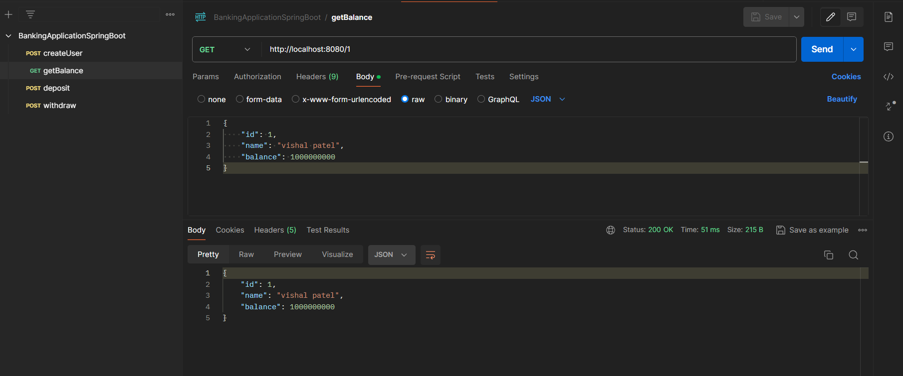
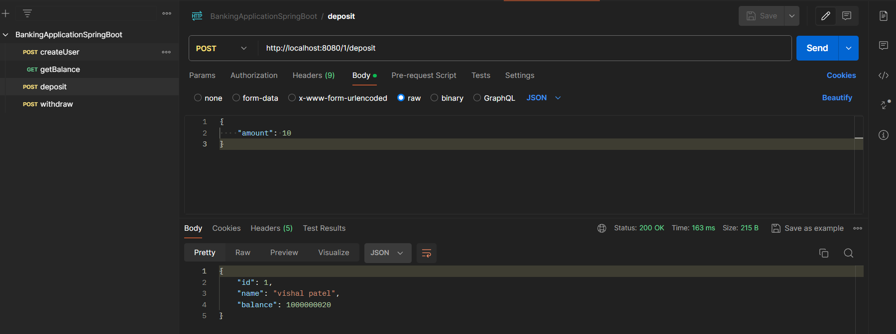

<!-- # anking_management_system -->
# Banking Application using Spring Boot

Build REST APIs for a simple Banking application using Spring Boot, Spring Data JPA (Hibernate) and MySQL database.

## Banking App with basic functionalities: 
   ### Creating a bank account
      
   ### Fetching account details
      
   ### Deposit/Withdrawal
      